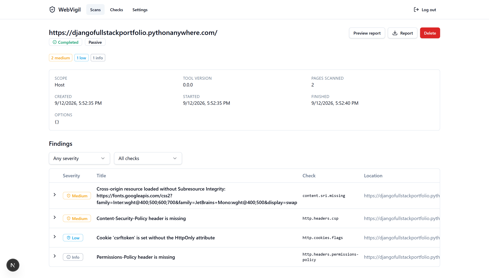
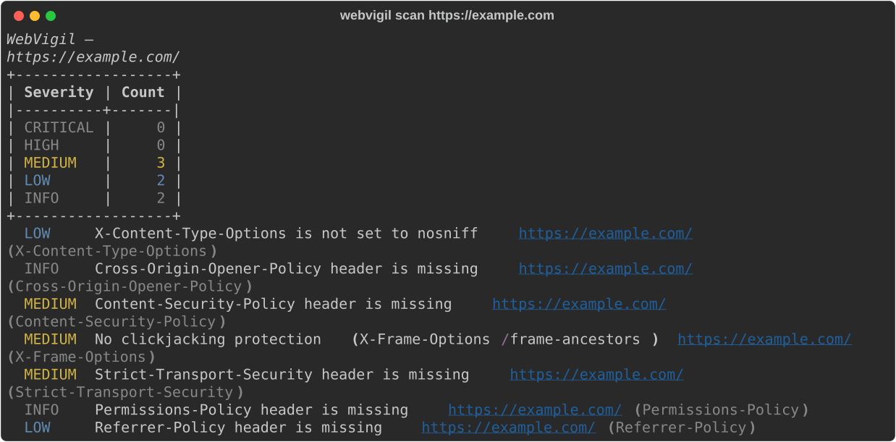

# WebVigil


[](https://github.com/ryanvmorais/webvigil/actions/workflows/ci.yml)


A web application vulnerability scanner for developers. It helps teams find and fix
security misconfigurations in web apps, both **in development** (terminal, CI, pre-deploy)
and **in production** (non-intrusive checks that are safe to run against live systems).

WebVigil ships as a reusable **scan engine**, a **CLI**, and an optional **web dashboard**
built on top of the same engine.

> **Status:** the planned coverage roadmap (`v0.1`–`v0.14`) is complete. The CLI, config,
> and report formats have been stable across the last several milestones; there is no
> `1.0` package tag yet. See [Scope and limitations](#scope-and-limitations) for what
> WebVigil deliberately does not do.

## WebVigil vs. other scanners

| | WebVigil | OWASP ZAP | Nuclei |
|---|---|---|---|
| Distribution | Library + CLI + optional dashboard | GUI + daemon (Docker/desktop) | CLI + YAML templates |
| Safe by default | Passive-only unless `--mode active` is explicit | Active scan is a common default workflow | Mostly read-only, template-dependent |
| Confirmed findings | Every active finding is proven against a per-request baseline | Signature + active-scan rules | Signature/template match |
| Best for | CI-native, in-band checks on your own app | Deep manual pentesting with a GUI/proxy | Fast sweeps against thousands of known CVE/misconfig templates |
| License | Apache-2.0 | Apache-2.0 | MIT |

WebVigil isn't a replacement for either — pair it with [Nuclei](https://github.com/projectdiscovery/nuclei)
for known-CVE template matching, or ZAP for manual, proxy-driven testing. See
[Scope and limitations](#scope-and-limitations) for the full boundary.

---

## Safe by default

WebVigil runs in **Safe Mode** by default: it only observes responses, headers, TLS
configuration, cookies, and page content. It never sends attack payloads and is safe to
point at production. The one request it adds beyond plain page fetches is a single GET
with an `Origin` header, used to detect reflective CORS — still a read-only GET, still
restricted to the target scope.

**Active Mode** (payload injection: XSS, SQLi, SSRF, etc.) is opt-in, requires an explicit
authorization flag, and is intended for development and staging environments only.

### Authorized use only

Only scan systems you own or are explicitly authorized to test. Unauthorized scanning may
be illegal. See [SECURITY.md](SECURITY.md).

---

## Coverage

WebVigil was built milestone by milestone against a planned roadmap. Every entry below has
shipped and links to its docs; each was designed as a spec first, under
[`specs/`](specs/).

| Version | Focus | Status |
|---|---|---|
| `v0.1` | Security headers, technology-disclosure headers, cookie flags, TLS/HTTPS configuration, CORS misconfiguration (all passive) | shipped |
| `v0.2` | Web API (FastAPI + SQLite, persistent scans, queued execution) | shipped |
| `v0.3` | Web dashboard (Next.js) | shipped |
| `v0.4` | Passive dependency fingerprinting: client-side JS libraries + known-vulnerability matching against a vendored Retire.js database ([docs](docs/dependency-fingerprinting.md)) | shipped |
| `v0.5` | Information disclosure: stack traces and directory listings (passive), plus opt-in probing for exposed `.git`/`.env`/backups/debug endpoints ([docs](docs/information-disclosure.md)) | shipped |
| `v0.6` | Active Mode: injection testing — reflected XSS, SQL injection (error/boolean/time), path traversal, open redirect ([docs](docs/active-injection.md)) | shipped |
| `v0.7` | Authenticated scanning (static cookies), CSRF detection, and form-driven crawling ([docs](docs/authenticated-scanning.md)) | shipped |
| `v0.8` | Stored / persistent XSS: opt-in two-phase inject-then-recrawl detection ([docs](docs/active-injection.md#stored-xss----stored-xss-opt-in)) | shipped |
| `v0.9` | In-band SSRF: cloud metadata service, loopback / internal resources, `file://` — detected from the target's own responses ([docs](docs/active-injection.md#ssrf--cloud-metadata-loopback-file)) | shipped |
| `v0.10` | Opt-in OSV.dev online advisory lookup for dependency fingerprinting, augmenting the vendored Retire.js database ([docs](docs/dependency-fingerprinting.md#osvdev-online-provider---osv-online)) | shipped |
| `v0.11` | Active Mode: in-band OS command injection (arithmetic echo + time-based) and server-side template injection ([docs](docs/active-injection.md#command-injection--ssti)) | shipped |
| `v0.12` | Active Mode: request-envelope injection — CRLF / response splitting, host-header injection, opt-in in-band XXE, and an HTTP-methods (TRACE / verb) check ([docs](docs/active-injection.md#request-envelope-injection)) | shipped |
| `v0.13` | Header / bearer authentication (`--header`), OpenAPI / Swagger import to seed the crawl and the injection pass (`--openapi`), and four passive checks: missing Subresource Integrity, mixed content, session identifier in a URL, private IP in a body ([docs](docs/api-scanning.md)) | shipped |
| `v0.14` | Active Mode: LDAP / XPath / SSI injection (in-band, error signature + differential), and opt-in unrestricted file-upload testing (`--file-upload`) — a benign marker uploaded with a dangerous name / type, then fetched back to prove execution, inline rendering, or a path-traversal write ([docs](docs/active-injection.md#file-upload----file-upload-opt-in)) | shipped |

> The four opt-in switches, all off by default: `--probe` (sensitive-path probing),
> `--stored-xss` and `--file-upload` (both write to the target), `--xxe` (re-types POST
> bodies as XML), `--osv-online` (sends library names to `api.osv.dev`). Everything else
> only reads.

---

## Scope and limitations

WebVigil is deliberately bounded. It is an **in-band** scanner: the engine talks only to the
target, sends a small static set of payloads, and confirms every active finding against a
per-request baseline. That line keeps it fast, low-noise, and safe to distribute as a
repository with no hosted service — at the cost of the classes below. For each, the thing
to reach for instead.

- **JavaScript-rendered apps.** The crawler parses HTML; it runs no headless browser, so a
  SPA that builds its DOM in JS exposes almost no surface to the crawl. *Instead:* point
  `--openapi` at the app's schema to seed the crawl and the injection pass directly, or
  feed URLs collected by your own browser-based crawler.

- **Blind / out-of-band vulnerabilities.** Blind SSRF, blind command injection, blind /
  OOB XXE, blind stored XSS with no reflected marker, and HTTP request smuggling all need
  either a collaborator server the scanner hosts (public domain, DNS/HTTP listeners) or
  raw-socket control of request framing. Both cross the "engine talks only to the target"
  rule. *Instead:* pair WebVigil with your own collaborator — Burp Collaborator,
  [interactsh](https://github.com/projectdiscovery/interactsh). Background:
  [why blind SSRF is the one thing WebVigil won't do](docs/notes/why-not-oast.md).

- **Some active-scan classes.** Expression-language injection (SpEL / OGNL), `eval()` code
  injection, NoSQL injection, HTTP parameter pollution, remote file inclusion, DOM XSS,
  and verb-based auth bypass are out — each is either deferred, has no reliable in-band
  oracle, or needs a browser. The full table of what is covered and what is not, with the
  reason for each, is in
  [`docs/active-injection.md`](docs/active-injection.md#coverage-boundaries).

- **Authentication.** WebVigil authenticates with a **static** cookie (`--cookie`) or
  header (`--header`) you supply. It does not drive a login form, an OAuth flow, or a
  token refresh, and it does not test session security (fixation, logout invalidation,
  weak session identifiers). *Instead:* log in with your browser and paste the session
  cookie. See [authenticated scanning](docs/authenticated-scanning.md).

- **Not a template scanner.** There is no Nuclei-style CVE-template database, no CMS or
  plugin enumeration, no exploit matching beyond the vendored Retire.js data and the
  opt-in OSV.dev lookup. *Instead:* run [Nuclei](https://github.com/projectdiscovery/nuclei)
  alongside it.

- **Not a fuzzer.** Payloads are a small, documented, in-repository set with no mutation
  engine and no WAF-evasion tuning; WebVigil tests the parameters a target actually
  exposes, not guessed ones. *Instead:* a dedicated fuzzer (ffuf, wfuzz) for parameter
  mining and brute force.

- **Not an exploitation framework.** A confirmed SQLi is proved with one bounded marker,
  not by dumping the database; a confirmed traversal reads one known file, not the whole
  disk. WebVigil stops at proof.

- **API-scanning edges.** `--openapi` reads **JSON** only (convert a YAML document first)
  and fuzzes query / path / form-urlencoded-body parameters — not individual fields of a
  JSON request body. These are current limits, not permanent ones.
  See [API scanning](docs/api-scanning.md).

---

## Quick start

> Requires Python 3.12+ and [uv](https://docs.astral.sh/uv/).

```bash
uv sync
uv run webvigil scan https://example.com
uv run webvigil scan https://example.com --format html --output report.html
uv run webvigil scan https://example.com --probe   # also probe for exposed .git/.env/backups
uv run webvigil scan https://example.com --mode active --authorized-by "you / engagement"  # injection + in-band SSRF testing
uv run webvigil scan https://example.com --mode active --authorized-by me --stored-xss     # + stored XSS (writes markers)
uv run webvigil scan https://example.com --mode active --authorized-by me --file-upload    # + file-upload testing (writes files)
uv run webvigil scan https://example.com --cookie "session=<paste from your browser>"      # authenticated scan
uv run webvigil scan https://example.com --openapi ./openapi.json                          # seed the scan from an API schema
uv run webvigil scan https://example.com --osv-online                                      # also check libraries against OSV.dev
uv run webvigil list-checks
uv run webvigil report report.json --format md      # re-render a saved scan, offline
```

By default the scan prints a summary to your terminal (stderr), a severity-count table
followed by one line per finding:



With `--format` it writes the report to stdout (or `--output PATH`), so you can pipe it.

Use in CI — fail the build on high-severity findings:

```bash
uv run webvigil scan "$TARGET_URL" --format sarif --output results.sarif --fail-on high
```

Exit codes: `0` clean · `3` findings at or above `--fail-on` · `4` operational error
(bad target, unreachable host, config) · `5` Active Mode without `--authorized-by`.

Install the CLI standalone with `pipx install .` or `uv tool install .`, or run it from the
bundled image: `docker build -t webvigil . && docker run --rm webvigil scan https://example.com`.

---

## Web API

An optional FastAPI service keeps a history of scans in SQLite and runs them through the
same engine. It is single-user and local-first.

```bash
pip install "webvigil[web]"        # or: uv sync --all-extras
webvigil-web serve                 # http://127.0.0.1:8000  (OpenAPI docs at /docs)
```

The database is created and migrated on first start; open `/docs` to create the account.
See [docs/web-api.md](docs/web-api.md) for configuration, auth, and backup.

---

## Web UI

A Next.js dashboard for the Web API: first-run setup, login, scan history, a new-scan form,
scan detail with filterable findings, report preview and download, the check catalogue, and
a settings screen. It is a thin client of the API — it never talks to the engine.

```bash
# API on :8000 in one shell (see above), then:
cd web
pnpm install
pnpm dev                           # http://localhost:3000

# or the whole stack in containers:
docker compose up --build          # dashboard on http://localhost:3000
```

The dashboard calls same-origin `/api/*`; Next proxies that to the API, so no CORS is
involved. See [docs/web-ui.md](docs/web-ui.md).

---

## Development

```bash
uv sync
uv run ruff check .
uv run black --check .
uv run mypy src
uv run lint-imports    # the engine must not import Typer/Rich/FastAPI/SQLModel/Uvicorn
uv run pytest

# Web UI (in web/):
pnpm install && pnpm lint && pnpm typecheck && pnpm test && pnpm build
pnpm test:e2e         # Playwright: setup → scan → report → logout, fully offline
```

See [docs/](docs/) for architecture, [the stack and why each piece was chosen](docs/stack.md), and a guide to writing your own checks.

---

## Design notes

Short essays on the reasoning behind specific decisions — the *why* behind a spec's ADRs,
written up on their own. Full index in [docs/notes/](docs/notes/).

- [The OAST problem: why blind SSRF is the one thing WebVigil won't do](docs/notes/why-not-oast.md)
- [False-positive discipline in an active scanner](docs/notes/false-positive-discipline.md)
- [Detecting stored XSS means writing data you can't take back](docs/notes/stored-xss-markers.md)
- [Keeping a security engine honest with import-linter](docs/notes/engine-boundaries.md)
- [OSV.dev without an API key](docs/notes/osv-without-a-key.md)

---

## License

[Apache-2.0](LICENSE)
